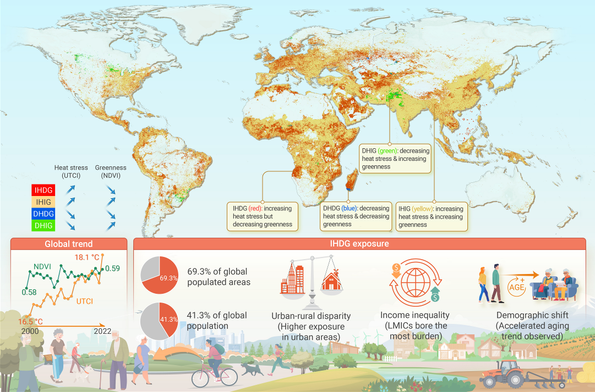
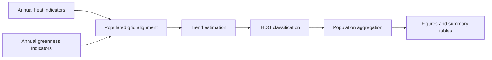

<div align="center">

# Global Population Exposed to Increasing Heat but Decreasing Greenness

### Public figures and analysis framework for the published IHDG global exposure study

[](https://doi.org/10.1016/j.xinn.2025.100870)




</div>

## About

This repository shares selected public-facing outputs and a reproducible analysis framework for the article:

> Ye T, Xu R, Huang W, Yang Z, Yu P, Yu W, Liu Y, Wu Y, Wen B, Zhang Y, Hart JE, Nieuwenhuijsen M, Abramson MJ, Guo Y, Li S. **Billions of people exposed to increasing heat but decreasing greenness from 2000 to 2022**. *The Innovation*. Published online March 7, 2025. https://doi.org/10.1016/j.xinn.2025.100870

The study assessed global exposure to areas experiencing **increasing heat but decreasing greenness (IHDG)** from 2000 to 2022, with stratification by geography, income group, urbanicity, and population age structure.

## Highlights

| Signal | Finding |
| --- | --- |
| Populated areas | 69.3% experienced increasing heat but decreasing greenness |
| Population exposed | 41.3% of the global population, approximately 2.9 billion people |
| Equity dimension | Low- and middle-income countries bore most of this burden |
| Settlement pattern | Urban areas were more affected than rural areas |
| Demographic pattern | Populations exposed to IHDG showed an accelerated aging trend |

## Quick Links

| Resource | Description |
| --- | --- |
| [`figures/`](figures/) | Published article figures and graphical abstract |
| [`analysis-framework/ihdg_workflow_skeleton.R`](analysis-framework/ihdg_workflow_skeleton.R) | Clean public workflow skeleton for the main analysis logic |
| [`docs/data_and_reproducibility.md`](docs/data_and_reproducibility.md) | Data categories, reproducibility notes, and what is intentionally not redistributed |
| [`CITATION.cff`](CITATION.cff) | Citation metadata for GitHub's citation panel |

## Figure Gallery

| Figure | File |
| --- | --- |
| Graphical abstract | [`PDF`](figures/graphical_abstract.pdf) · [`PNG`](figures/graphical_abstract.png) |
| Figure 1 | [`figure_1.pdf`](figures/figure_1.pdf) |
| Figure 2 | [`figure_2.pdf`](figures/figure_2.pdf) |
| Figure 3 | [`figure_3.pdf`](figures/figure_3.pdf) |
| Figure 4 | [`figure_4.pdf`](figures/figure_4.pdf) |
| Figure 5 | [`figure_5.pdf`](figures/figure_5.pdf) |

## Analysis Framework

The full internal analysis project contains local paths, intermediate files, and data products that are not prepared for direct public release. Instead, this repository provides a clean framework script that documents the core workflow:



The public skeleton covers:

1. Build annual heat and greenness indicators.
2. Align raster indicators with populated grid cells.
3. Estimate long-term trends for heat and greenness.
4. Classify populated cells into IHDG and other trend combinations.
5. Aggregate exposed populations by country, income group, continent, urbanicity, and age group.
6. Generate publication figures and summary tables.

## Data Availability

This repository does **not** redistribute third-party geospatial, demographic, or climate datasets. See [`docs/data_and_reproducibility.md`](docs/data_and_reproducibility.md) for the data categories used and guidance for reproducing the analysis with appropriately licensed data sources.

## Citation

Please cite the published article when using or discussing these materials:

```bibtex
@article{ye2025ihdg,
  title = {Billions of people exposed to increasing heat but decreasing greenness from 2000 to 2022},
  author = {Ye, Tingting and Xu, Rongbin and Huang, Wenzhong and Yang, Zhengyu and Yu, Pei and Yu, Wenhua and Liu, Yanming and Wu, Yao and Wen, Bo and Zhang, Yiwen and Hart, Jaime E. and Nieuwenhuijsen, Mark and Abramson, Michael J. and Guo, Yuming and Li, Shanshan},
  journal = {The Innovation},
  year = {2025},
  doi = {10.1016/j.xinn.2025.100870}
}
```

## License

The article is open access under the license stated by the journal. The public figures in this repository are shared for scholarly communication related to the published article.
